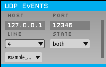
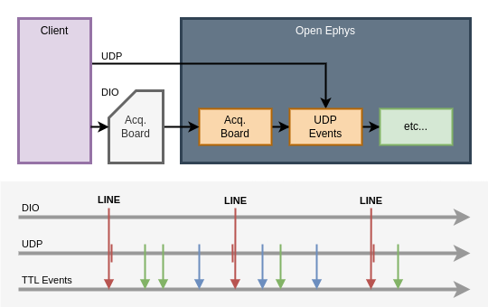
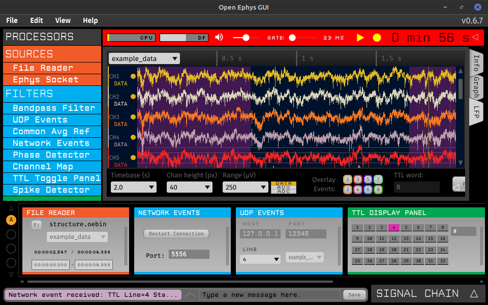

# UDP Events

This repo is for an [Open Ephys GUI](https://github.com/open-ephys/plugin-GUI) processor plugin.
It's based on the Open Ephys [processor plugin template](https://github.com/open-ephys-plugins/processor-plugin-template).
For more info on Open Ephys and plugins in general, please see the [Open Ephys docs](https://open-ephys.github.io/gui-docs/Tutorials/How-To-Make-Your-Own-Plugin.html).

The UDP Events plugin can inject TTL and Text events into an existing Open Ephys data stream via a UDP network socket.
It can align the "soft" timestamps from an external system to "real" sample numbers in the existing data stream.
For TTL messages, the timestamp alignment can have high precision (more precise than Open Ephys data blocks).



UDP Events will bind a **HOST** address and **PORT** number where it can receive UDP messages.

It will look for real, upstream TTL events on a selected **LINE** and use these to align soft TTL and Text messages received via UDP.

It will add aligned TTL and Text messages to a selected Open Ephys data stream, shown here as "**example_...**".

## Downloading and Installing

We're building the plugin for different platforms using GitHub Actions.
To download a built plugin go to the latest build for your platform at this repo's [actions](https://github.com/benjamin-heasly/UDPEvents/actions) page.

On the latest build page, look for the "Artifacts" section.
Download an artifact with a name like `UDPEvents-system_version-API8.zip` and unzip it.

### Linux

On Linux the `.zip` file contains a dynamic library file called `UDPEvents.so`.
This is the plugin.

Copy `UDPEvents.so` into the `plugins/` subdir of your Open Ephys GUI installation.
You might need to figure out where this is.
For example, using the [official Ubuntu installer](https://open-ephys.github.io/gui-docs/User-Manual/Installing-the-GUI.html#linux) the `plugins/` subdir ended up at `/usr/local/bin/open-ephys-gui/plugins/`.

So, a copy command like this should work:

```
sudo cp UDPEvents.so /usr/local/bin/open-ephys-gui/plugins/
```

Once the plugin is copied over you should be able to launch `open-ephys` and see "UDP Events" listed along with other plugins.

#### subdir ownership

For some reason, on one laptop, the installed `/usr/local/bin/open-ephys-gui` directory was owned by the `docker` user.
Was this a weird quirk of the Open Ephys installer?
Regardless, you might need to fix the ownership of this directory make it like the rest of `/usr/local/bin/`.

```
sudo chown -R root:root /usr/local/bin/open-ephys-gui/
```

### Windows

On Windows the `.zip` file contains a dynamic library file called `UDPEvents.dll`.
This is the plugin.

Copy `UDPEvents.dll` into the `plugins/` subdir of your Open Ephys GUI installation.
You might need to figure out where this is.
A typical location might be:

```
C:\Program Files\Open Ephys\plugins
```

Once the plugin is copied over, you should be able to launch the Open Ephys GUI and see "UDP Events" listed along with other plugins.

### macOS

TODO...

## Integrating with Clients

The UDP Events plugin will act like a server that starts and stops whenever Open Ephys starts and stops acquisition.
During acquisition UDP Events will bind its **HOST** address and UDP **PORT** and wait for messages to arrive from a client.
As each message arrives, UDP Events will:

 - take a local timestamp
 - reply to the client with this timestamp, as an acknowledgement
 - parse the message as a TTL or Text event
 - save the message in a queue, to be added to an existing data stream along with other data being processed

The ack timestamps are informational only.
Clients can use them to check that they are connecting to UDP Events as expected, and can expect that the timesamps will increase over time.

Clients should send events as a single UDP message each, with binary data in one of the two formats described below.
For a working example client in Python, see [test-client.py](./test-client.py) in this repo.

### TTL Events

TTL event messages should have exactly 11 bytes:

| byte index | number of bytes | data type | description |
| --- | --- | --- | --- |
| 0 | 1 | uint8 | **message type** for TTL messages this is the literal value `0x01` |
| 1 | 8 | double | **timestamp** event time in seconds (including fractions) from the client's point of view |
| 9 | 1 | uint8 | **line number** 0-based line number for an Open Ephys TTL line (0-255) |
| 10 | 1 | uint8 | **line state** on/off state for the Open Ephys TTL line (nonzero is "on") |

### Text Events

Text event messages should start with exactly 11 header bytes, followed by a variable number of text bytes:

| byte index | number of bytes | data type | description |
| --- | --- | --- | --- |
| 0 | 1 | uint8 | **message type** for Text messages this is the literal value `0x02` |
| 1 | 8 | double | **timestamp** event time in seconds (including fractions) from the client's point of view |
| 9 | 2 | uint16 | **text length** byte length of text that follows (network byte order -- use [htons()](https://beej.us/guide/bgnet/html/#htonsman)) |
| 11 | **text length** | char | **text** message text encoded as ASCII or UTF-8 |

### Ack Timestamps

UDP Events will reply to the sender of each message with an 8-byte acknowledgement:

| byte index | number of bytes | data type | description |
| --- | --- | --- | --- |
| 0 | 8 | double | **timestamp** ack time in seconds from the UDP Events point of view |

## Data Stream Alignment

UDP Events will align soft timestamps received in UDP messages to real sample numbers in a selected Open Ephys data stream.
The alignment can preserve high timing precision -- more precise than the start of each Open Ephys data block.

### TTL Event Pairs

For this alignment to work the client must send TTL Event messages via UDP with the same **LINE** number as a real, upstream TTL events on the same Open Ephys data stream.
The soft timestamp for these TTL event messages should be the client's best estimate of when the real TTL event actually occurred, from the client's point of view.

UDP Events will look for pairs of TTL events on the same **LINE** -- one from UDP and one from upstream in Open Ephys.
For each pair it will estimate and record a conversion from client soft timestamp to data stream sample number.

As other TTL and Text events arrive via UDP, UDP Events will convert their soft timestamps to the closest sample number on the selected data stream, and add the events to the stream.

### Accuracy

Alignment accuracy will be limited by how well the client can measure when real TTL events actually occurred and report its measurements via UDP.
So, UDP Events will make the most sense when the client has solid timing and has control over both the UDP messages and the corresponding upstream events.
Such a client could enrich a single DIO line with various other "soft TTL" and Text events.



## Testing

You can test UDP Events using a Python script like [test-client.py](./test-client.py) in this repo.
This script depends on [pyzmq](https://pypi.org/project/pyzmq/).
You might be able to install this with `pip install pyzmq`.

This script also expects an Open Ephys signal chain with the following:

 - [File Reader](https://open-ephys.github.io/gui-docs/User-Manual/Plugins/File-Reader.html) -- Provide sample data and a data stream to work in.
 - [Network Events](https://open-ephys.github.io/gui-docs/User-Manual/Plugins/Network-Events.html) -- Create upstream TTL events for UDP Events to look for.
 - UDP Events -- this plugin!
 - [TTL Display Panel](https://open-ephys.github.io/gui-docs/User-Manual/Plugins/TTL-Panels.html) -- Blink as TTL events arrive.
 - [LFP Viewer](https://open-ephys.github.io/gui-docs/User-Manual/Plugins/LFP-Viewer.html) -- Show TTL events aligned with upstream sampled signals.
 - [Record Node](https://open-ephys.github.io/gui-docs/User-Manual/Plugins/Record-Node.html) -- Save data for detailed inspection.



### Phony Client
In this setup, [test-client.py](./test-client.py) will play the role of "client", with control over both Network Events and UDP Events.

The signal chain's File Reader and Network Events together will stand in for a genuine data source like an [Acquisition Board](https://open-ephys.github.io/gui-docs/User-Manual/Plugins/Acquisition-Board.html), which might record both sampled signals and TTL events with respect to a single clock.
Timing accuracy of this test setup will be limited by the relatively coarse, best-effort timing alignment of Network Events with upstream sample numbers.

Choose **LINE** 4 in the UDP Events settings editor, to match the line numbers hard-coded in `test-client.py`.

### Running a Test

To start a test press the Open Ephys Record button.
This will start data streaming from the File Reader's example file.
Waveforms should apear in the LFP Viewer window.

While acquisition is still running, execute the client script.

```
python test-client.py
```

This should run for about 10 seconds, then stop.  While running it will send a series of events to Open Ephys.

The script will send 10 pairs of TTL events on **LINE** 4.  For each pair:
 - a real/upstream event sent to Network Events
 - a soft UDP counterpart sent to UDP Events

The upstream events themselves should be visible as blinking lights in the TTL Display Panel, and transparent overlays in the LFP Viewer window.  UDP Events will use the event pairs to align other events, below, and instert them into the selected data stream.

The script will also send 10 pairs of soft TTL events on **LINE** 1:
 - one to turn line 1 on
 - antoher to turn line 1 off

These cycle line 1 as fast as the script can manage.
The cycle time will usually be too quick to see in the TTL Display Panel or LFP viewer.
But these events should be saved in the recorded data file with high timing precision -- perhaps receiving sample numbers that are 1 or 2 samples apart.

Along with TTL event mesages above, the script will send 10 Text messages via UDP, which should also be saved in the data file.

If all this happens, then it seems UDP Events is working for you!
